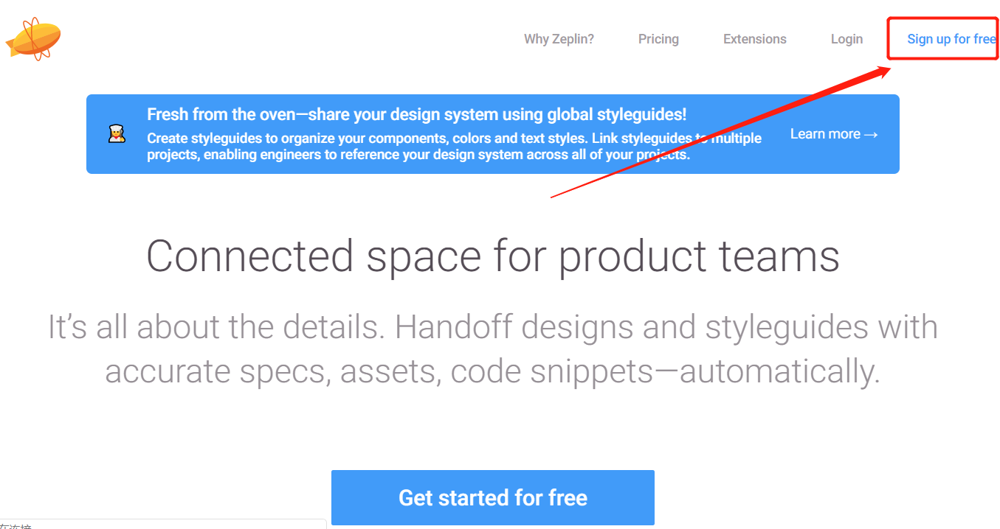
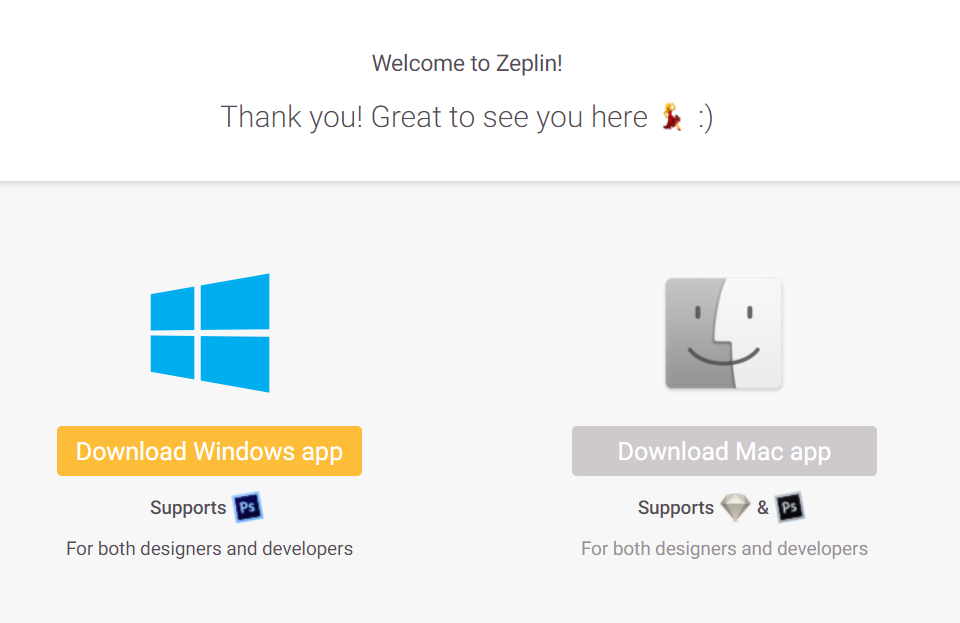
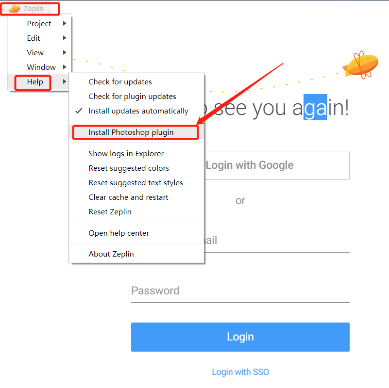
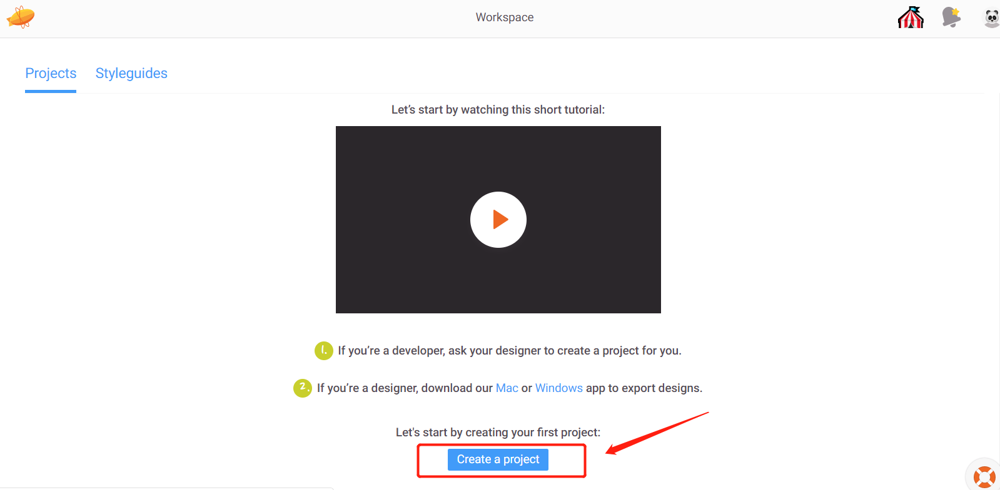
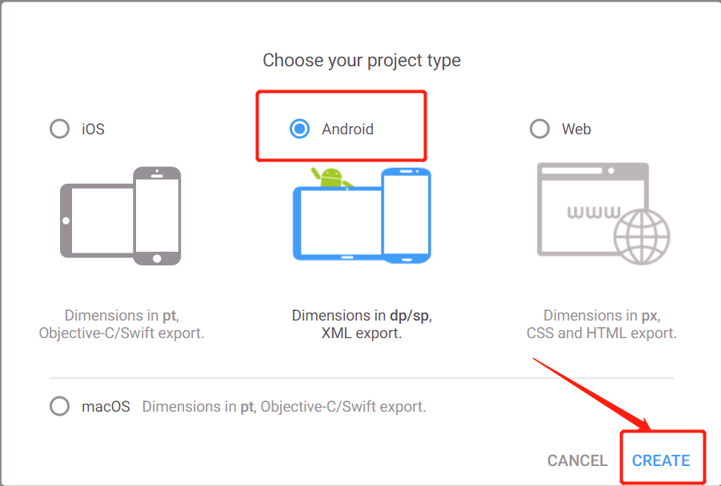

# 1、什么是Zeplin?
 >Zeplin是一款为设计师和开发者提供设计图交接与沟通的高效平台，核心功能为标注。设计师可通过插件(目前仅支持PS和sketch)将已完成的设计图直接导入到Zeplin中，无需手动标注，开发者在Zeplin查看设计图时可通过鼠标点击设计图 显示相应位置的尺寸、色值、文字大小等信息。

## 效果：
  

# 2、Zeplin的作用
 * 对于设计师来说:
不用做标注，省很多事，也不需要总担心标注漏了什么，程序员又来问来问去

 * 对于开发者来说:
不需要费心将标注的px换算成自己需要的尺寸，也不用担心设计师标注漏了什么

# 3 注册并验证Zeplin账户
## 3.1、[打开Zeplin官网](https://zeplin.io/): https://zeplin.io/
  

## 3.2、注册Zepli账户
 

## 3.3、打开邮箱接受验证邮件，并激活账户(可能会被误认为辣鸡邮件)
 

## 3.4、下载并安装客户端(windows或mac)
 

# 4、使用zeplin
## 4.1、安装Photoshop导出插件(需先关闭PS)
打开zeplin客户端，点击左上角。
 
 
 

## 4.2、在zeplin中创建项目
 
 
 
## 4.3、在Zeplin项目中邀请开发者参与
右下角，Members -> Invite