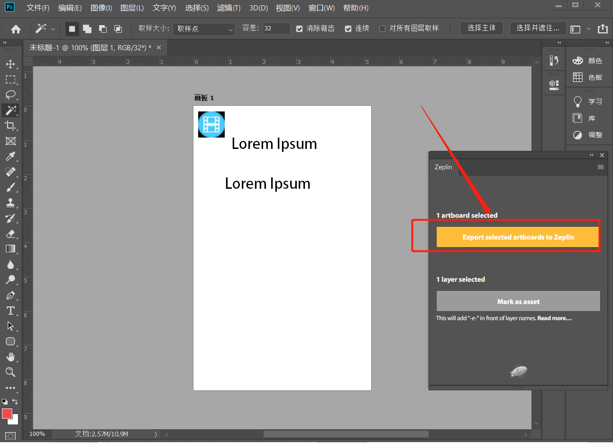

# 从Adobe Photoshop CC中导出设计图到Zeplin

* 首先，我们需要确保ps中已经安装好了zeplin插件，我们可以在窗口，扩展功能中看到
* 然后，我们打开一个psd文件，打开zeplin插件，可以看到说明，是将画板导入到zeplin

* psd中默认是以图层的形式呈现的，我们需要先将图层转换成画板，先选中所有的图层（按住shift键，分别选中第一个图层和最后一个图层），右键-来自图层的画板。
* 这样，软件会提示我们即将从图层新建画板，可以为画板重命名，定义高度和宽度，我们直接点击确定即可。
* 此时选中画板，Zeplin面板就会显示这个黄色的按钮，点击按钮会提示你选择要导入到哪个Zeplin项目中(勾选下方的蓝色框会覆盖更新相同命名的画板)，点击“import”即可开始上传，然后等待上传完成即可。
