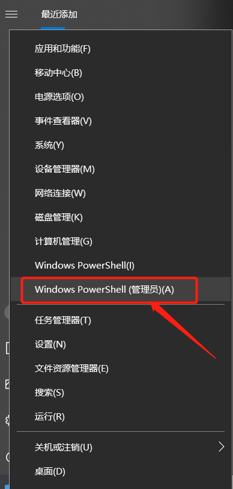
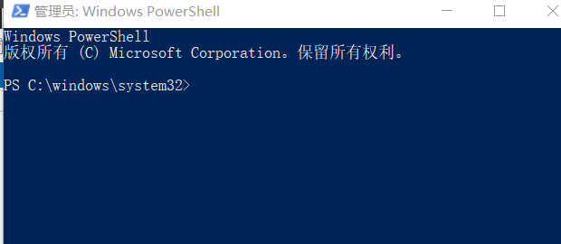
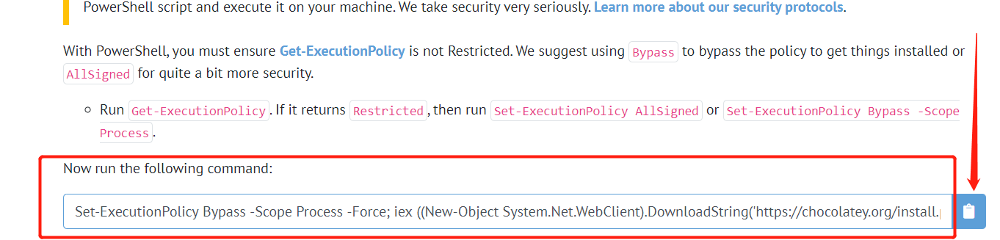

# 一、安装

安装 Chocolatey，需要 管理员：Windows PowerShell 命令行工具下面去执行一行命令（cmd），
1、鼠标右击左下角的开始，弹出如下图：



2、点击上图标注处，弹出管理员：Windows PowerShell终端，如下图：



3、[打开Chocolatey官网](https://chocolatey.org/install),复制如图标注的代码到上图打开的命令行窗口运行



４、检查安装结果
```
$ choco -?

This is a listing of all of the different things you can pass to choco.

Commands

 * list - lists remote or local packages
 * find - searches remote or local packages (alias for search)
 * search - searches remote or local packages (alias for list)
 * info - retrieves package information. Shorthand for choco search pkgname --exact --verbose
 * install - installs packages from various sources
 * pin - suppress upgrades for a package
 * outdated - retrieves packages that are outdated. Similar to upgrade all --noop
 * upgrade - upgrades packages from various sources
 * uninstall - uninstalls a package
 * pack - packages up a nuspec to a compiled nupkg
 * push - pushes a compiled nupkg
 * new - generates files necessary for a chocolatey package from a template
 * sources - view and configure default sources (alias for source)
 * source - view and configure default sources
 * config - Retrieve and configure config file settings
 * feature - view and configure choco features
 * features - view and configure choco features (alias for feature)
 * setapikey - retrieves, saves or deletes an apikey for a particular source (alias for apikey)
 * apikey - retrieves, saves or deletes an apikey for a particular source
 * unpackself - have chocolatey set itself up
 * version - [DEPRECATED] will be removed in v1 - use `choco outdated` or `cup <pkg|all> -whatif` instead
 * update - [DEPRECATED] RESERVED for future use (you are looking for upgrade, these are not the droids you are looking for)
```

译为：

```
*list-列出远程或本地包

*find-搜索远程或本地包（搜索别名）

*搜索-搜索远程或本地包（列表的别名）

*信息-检索包信息。choco search pkgname的简写--准确--冗长

*安装-安装来自不同来源的软件包

*pin-禁止升级包

*过时-检索过时的包。类似于全部升级--noop

*升级-从不同来源升级软件包

*卸载-卸载包

*pack-将nuspec打包成编译的nupkg

*push-推送编译的nupkg

*新建-从模板生成巧克力包所需的文件

*源-查看和配置默认源（源的别名）

*源-查看和配置默认源

*config-检索并配置配置文件设置

*功能-查看和配置choco功能

*功能-查看和配置choco功能（功能的别名）

*setapikey-检索、保存或删除特定源的apikey（apikey的别名）

*apikey-检索、保存或删除特定源的apikey

*打开包装-准备好巧克力

*版本-[已弃用]将在v1中删除-改用“choco过时”或“cup<pkg all>-whatif”

*更新-[不推荐]保留以备将来使用（您正在寻找升级，这些不是您正在寻找的机器人）
```

# 二、使用

以gitbook-editor为例，  

```
PS C:\windows\system32> choco search gitbook-editor
Chocolatey v0.10.15
gitbook-editor 7.0.12 [Approved]
1 packages found.
PS C:\windows\system32> choco install gitbook-editor
Chocolatey v0.10.15
Installing the following packages:
gitbook-editor
By installing you accept licenses for the packages.
Progress: Downloading gitbook-editor 7.0.12... 100%
```

