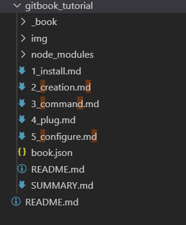
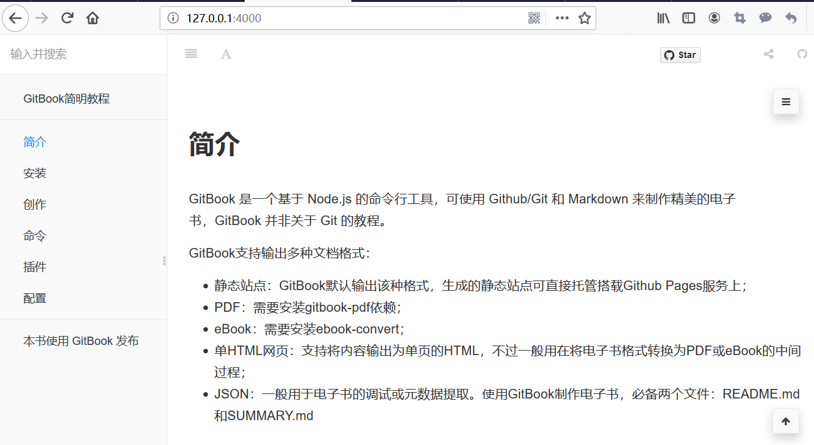

# 创作
 > GitBook用于创作电子书，主要有以下几个步骤：

## 1、新建一本书 gitbook init  
 > 为新书创建一个目录：gitbook_tutorial，进入gitbook_tutorial目录，初始化。
 ```
 $ mkdir gitbook_tutorial
 $ cd gitbook_tutorial
 $ gitbook init
 warn: no summary file in this book
 info: create README.md
 info: create SUMMARY.md
 info: initialization is finished
 ```  
 > 运行gitbook init命令会创建 README.md 和 SUMMARY.md 这两个文件，README.md  是说明文档， SUMMARY.md是书的章节目录，其默认内容如下所示：  

 ```
 # Summary

 * [Introduction](README.md)

 ```

## 2、编排书的目录结构
 > 进入目录gitbook_tutorial，在其中创建下列文件。

```
$ npx -p touch nodetouch 1_install.md
$ npx -p touch nodetouch 2_creation.md
$ npx -p touch nodetouch 3_command.md
$ npx -p touch nodetouch 4_plug.md
$ npx -p touch nodetouch 5_configure.md
```  
如下图：  


 > 编辑SUMMARY.md文件：

```
  # Summary

  * [简介](README.md)
  * [安装](1_install.md)
  * [创作](2_creation.md)
  * [命令](3_command.md)
  * [插件](4_plug.md)
  * [配置](5_configure.md)
```

## 3、编辑书的内容
 以README.md为例：
```
    # 简介

    GitBook 是一个基于 Node.js 的命令行工具，可使用 Github/Git 和 Markdown 来制作精美的电子书，GitBook 并非关于 Git 的教程。  

    GitBook支持输出多种文档格式：  

    - 静态站点：GitBook默认输出该种格式，生成的静态站点可直接托管搭载Github Pages服务上；
    - PDF：需要安装gitbook-pdf依赖；
    - eBook：需要安装ebook-convert；
    - 单HTML网页：支持将内容输出为单页的HTML，不过一般用在将电子书格式转换为PDF或eBook的中间过程；
    - JSON：一般用于电子书的调试或元数据提取。
    使用GitBook制作电子书，必备两个文件：README.md和SUMMARY.md
```

## 4、预览全貌
   > 在终端输入 
  ```
  $ gitbook serve 
  ```
   > 然后在浏览器地址栏中输入 http://localhost:4000 便可预览书籍.  

   如下图：  

   