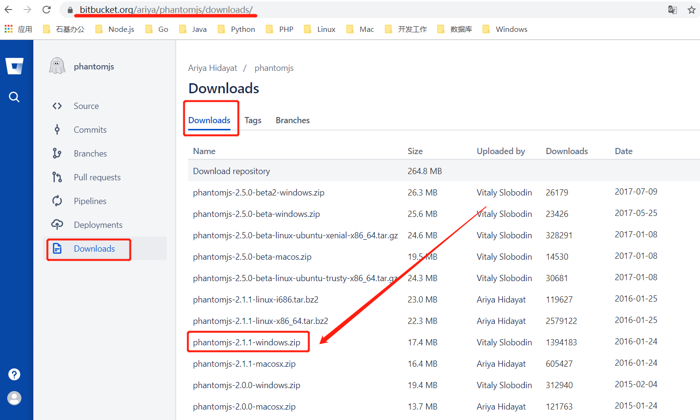
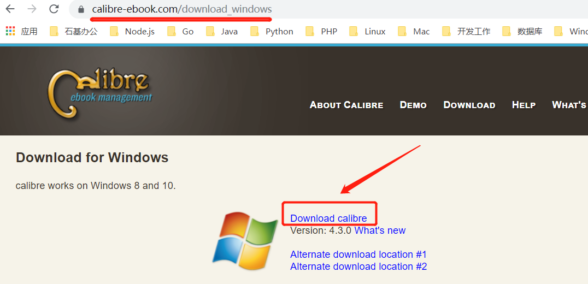

# GitBookl转成PDF

**需要下载两个插件 1、phantomjs；2、calibre**
## 1、下载相关插件
 * [下载phantomjs](https://bitbucket.org/ariya/phantomjs/downloads/) : https://bitbucket.org/ariya/phantomjs/downloads/  

    

 * [下载calibre](https://calibre-ebook.com/download_windows): https://calibre-ebook.com/download_windows    

  
## 2、安装插件
### 1、phantomjs只需解压，并将解压后的目录添加到环境变量
### 2、运行calibre安装程序，并将安装目录添加到环境变量
### 3、用npm全局安装gitbook-pdf
```
$ npm install gitbook-pdf -g
```
## 3、生成PDF文件
切换到你之前自己写的电子书文档目录，执行如下命令：
```
$ gitbook pdf ./pdffilename
```